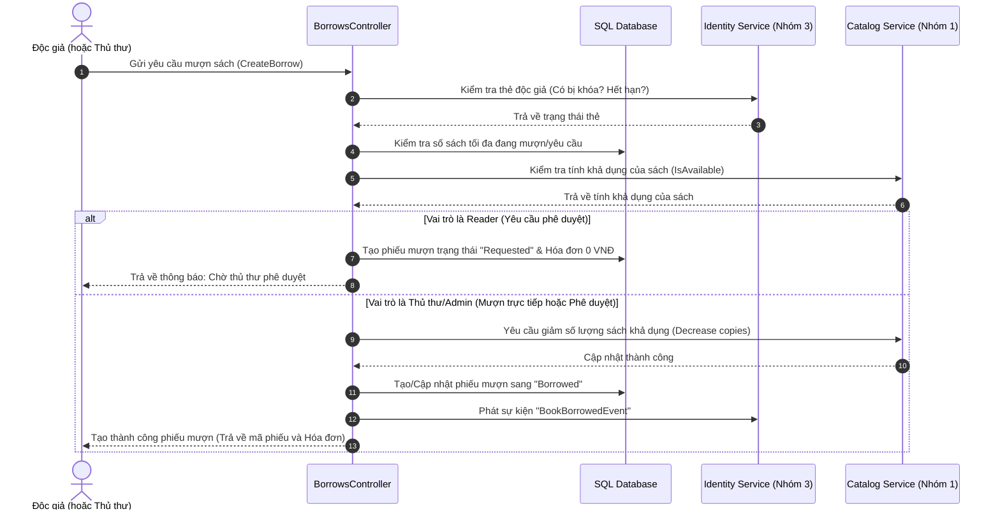

# 📚 Tài liệu Cấu trúc & Cách thức hoạt động của CirculationService (Nhóm 2)

**CirculationService** (Dịch vụ Lưu thông) là một phân hệ quan trọng trong hệ thống quản lý thư viện số **LibraryMicroservices**. Dịch vụ này chịu trách nhiệm chính về nghiệp vụ mượn sách, trả sách, kiểm soát quá hạn, tính toán và thanh toán tiền phạt trễ hạn, đồng thời tích hợp dữ liệu với các phân hệ khác (Catalog Service và Identity/Report Service).

---

## 📁 1. Cấu trúc Thư mục và Các File trong Dự án

Dưới đây là sơ đồ cấu trúc thư mục và mô tả vai trò của từng file trong dự án [CirculationService](file:///d:/full-stack/CNTT17-12/LibraryMicroservices/CirculationService):

```text
CirculationService/
│
├── Program.cs                         # Điểm khởi đầu cấu hình và khởi chạy ứng dụng
├── appsettings.json                   # File cấu hình môi trường, DB, JWT, API Keys và cấu hình mặc định
├── CirculationService.csproj          # File dự án định nghĩa các package dependency (.NET Core)
│
├── Data/                              # Tầng kết nối Cơ sở dữ liệu (Database Layer)
│   └── CirculationDbContext.cs        # Lớp DbContext quản lý ánh xạ thực thể xuống cơ sở dữ liệu SQL Server
│
├── Models/                            # Các thực thể cơ sở dữ liệu (Database Entities)
│   ├── BorrowRecord.cs                # Thực thể lưu vết phiếu mượn/trả sách
│   └── Invoice.cs                     # Thực thể lưu vết hóa đơn liên quan (Mượn, Trả, Phạt trễ hạn)
│
├── DTOs/                              # Các đối tượng truyền tải dữ liệu (Data Transfer Objects)
│   ├── Borrows/                       # DTO phục vụ trực tiếp cho nghiệp vụ lưu thông
│   │   ├── ApproveBorrowRequest.cs
│   │   ├── BorrowResponse.cs
│   │   ├── BorrowSettingsResponse.cs
│   │   ├── BorrowStatsResponse.cs
│   │   ├── CreateBorrowRequest.cs
│   │   ├── FinePaymentQrResponse.cs
│   │   ├── InvoiceResponse.cs
│   │   ├── ReaderBorrowRequest.cs
│   │   ├── ReturnBookRequest.cs
│   │   └── UpdateBorrowSettingsRequest.cs
│   └── External/                      # DTO ánh xạ dữ liệu nhận/gửi từ/đến các Microservices khác
│       ├── BookAvailabilityResponse.cs
│       ├── BookBorrowedEventRequest.cs
│       ├── BookReturnedEventRequest.cs
│       ├── BookSummaryResponse.cs
│       ├── ReaderStatusResponse.cs
│       └── ReaderSummaryResponse.cs
│
├── Services/                          # Lớp nghiệp vụ và giao tiếp ngoại vi (Business & Integration Layer)
│   ├── BorrowSettingsService.cs       # Quản lý cấu hình quy tắc mượn trả tại runtime (Singleton)
│   ├── CatalogClient.cs               # Giao tiếp HTTP với Catalog Service (Nhóm 1)
│   └── IdentityReportClient.cs        # Giao tiếp HTTP với Identity & Report Service (Nhóm 3)
│
└── Controllers/                       # Lớp điều khiển API (Presentation Layer)
    ├── BorrowSettingsController.cs    # Điểm cuối xem và cập nhật quy tắc mượn trả (Admin/Librarian)
    ├── BorrowsController.cs           # Xử lý các luồng mượn/trả sách, phạt trễ hạn, lấy danh sách/thống kê
    ├── InvoicesController.cs          # Truy vấn các hóa đơn biên lai của độc giả
    ├── ProxyController.cs             # Cổng trung gian điều phối dữ liệu sách/độc giả về Frontend
    └── DevTokenController.cs          # Hỗ trợ tạo JWT token giả lập phục vụ kiểm thử (chỉ chạy ở Development)
```

---

## ⚙️ 2. Chi tiết vai trò của các File quan trọng

### A. Tầng Cấu hình và Khởi tạo (Root Files)
* **Program.cs**:
  * Cấu hình Dependency Injection (DI): Đăng ký `CirculationDbContext` (SQL Server), các HTTP Clients (`CatalogClient`, `IdentityReportClient`), và dịch vụ Singleton `BorrowSettingsService`.
  * Tích hợp xác thực **JWT Authentication** để bảo mật API.
  * Cấu hình **Swagger OpenApi** hỗ trợ nhập Bearer Token phục vụ việc test API trực quan.
  * Định nghĩa Pipeline xử lý HTTP request: Middleware xác thực (`UseAuthentication`), phân quyền (`UseAuthorization`), và CORS (`AllowAllForDev`).
* **appsettings.json**:
  * Lưu trữ chuỗi kết nối cơ sở dữ liệu SQL Server (`DefaultConnection`).
  * Lưu khóa bảo mật JWT (`Jwt:Key`) để xác thực chữ ký token.
  * Lưu trữ cấu hình liên kết Microservices gồm địa chỉ IP và Port của dịch vụ Catalog (`Services:CatalogBaseUrl`) và Identity (`Services:IdentityReportBaseUrl`).
  * Lưu thông tin cấu hình tài khoản ngân hàng để tạo mã QR nộp phạt trúng tài khoản qua VietQR.

### B. Tầng Cơ sở dữ liệu & Model (Data & Models)
* **CirculationDbContext.cs**:
  * Kế thừa từ `DbContext` của Entity Framework Core.
  * Sử dụng **Fluent API** trong phương thức `OnModelCreating` để thiết lập ràng buộc dữ liệu: độ thái tối đa thuộc tính, chỉ định kiểu dữ liệu tiền tệ (`decimal(18,2)`), thiết lập khóa ngoại liên kết giữa `Invoice` và `BorrowRecord` (hỗ trợ xóa Cascade khi phiếu mượn bị xóa).
  * Định nghĩa các **Index** trên các trường được tìm kiếm thường xuyên như `ReaderId`, `BookId`, `Status`, `BorrowRecordId` nhằm tối ưu tốc độ truy vấn cơ sở dữ liệu.
* **BorrowRecord.cs**:
  * Đại diện cho bảng `BorrowRecords` trong cơ sở dữ liệu.
  * Chứa trạng thái phiếu mượn (`Status` gồm các giá trị: `Requested` - Đang yêu cầu, `Borrowed` - Đang mượn, `Returned` - Đã trả, `Rejected` - Bị từ chối).
  * Lưu thông tin phạt trễ hạn: `FineAmount` (số tiền phạt) và `IsFinePaid` (đã thanh toán chưa).
* **Invoice.cs**:
  * Đại diện cho bảng `Invoices` lưu hóa đơn tài chính.
  * Có trường phân loại `Type` (`Borrow` cho mượn trực tiếp, `Return` cho biên lai trả sách, `FinePayment` khi thanh toán tiền phạt).

### C. Tầng Nghiệp vụ và Giao tiếp Liên Dịch Vụ (Services)
* **BorrowSettingsService.cs**:
  * Dịch vụ được thiết kế theo dạng **Singleton**. Khi khởi tạo, nó đọc cấu hình giới hạn mượn mặc định từ `appsettings.json`.
  * Admin có thể thay đổi các giá trị này thông qua API tại runtime. Các cấu hình mới sẽ tồn tại trực tiếp trong bộ nhớ RAM mà không cần khởi động lại ứng dụng.
* **CatalogClient.cs**:
  * Sử dụng `HttpClient` để kết nối tới **Catalog Service (Nhóm 1)**.
  * Sử dụng `X-Internal-Service-Key` trong Header để xác thực quyền gọi API nội bộ giữa các microservices.
  * Cung cấp các API: Kiểm tra trạng thái sẵn sàng của sách (`GetBookAvailabilityAsync`), giảm số bản sao khi mượn (`DecreaseAvailableCopiesAsync`), tăng số bản sao khi trả (`IncreaseAvailableCopiesAsync`).
* **IdentityReportClient.cs**:
  * Giao tiếp với **Identity & Report Service (Nhóm 3)**.
  * Cung cấp API để kiểm tra trạng thái thẻ thư viện độc giả (`GetReaderStatusAsync`) xem thẻ có bị khóa (`IsLocked`) hay hết hạn (`IsCardExpired`) hay không.
  * Gửi các sự kiện bất đồng bộ (`SendBookBorrowedEventAsync`, `SendBookReturnedEventAsync`) cho Nhóm 3 khi có nghiệp vụ mượn/trả xảy ra để phục vụ cho các báo cáo thống kê của thư viện.

### D. Tầng API Endpoints (Controllers)
* **BorrowsController.cs**:
  * Là "đầu não" xử lý các HTTP Requests về mượn/trả.
  * Chứa logic nghiệp vụ phức tạp như kiểm tra điều kiện mượn, tính toán số ngày quá hạn và tiền phạt quá hạn (`FineAmount`), thanh toán phạt (`PayFine`), và sinh liên kết hình ảnh QR thanh toán qua cổng ngân hàng (`GetFinePaymentQr`).
* **ProxyController.cs**:
  * Hoạt động như một **API Gateway thu nhỏ**.
  * Giúp Frontend đơn giản hóa các kết nối. Thay vì Frontend phải tự gọi trực tiếp và thiết lập Header JWT tới API của Nhóm 1 và Nhóm 3, Frontend chỉ cần gọi tới `ProxyController` của Nhóm 2. Lớp này sẽ trích xuất Token JWT từ request hiện tại, forward nó sang microservices tương ứng để lấy dữ liệu Sách và Độc giả trả về cho Frontend.

---

## 🔁 3. Cách thức hoạt động & Quy trình Nghiệp vụ chính

### Luồng 1: Quy trình Đăng ký mượn sách và Phê duyệt



### Luồng 2: Quy trình Trả sách và Tính phạt trễ hạn

Khi độc giả đem sách tới trả:
1. **Thủ thư** thực hiện gọi API `PUT /api/borrows/{id}/return`.
2. Hệ thống lấy thông tin phiếu mượn từ Cơ sở dữ liệu và kiểm tra xem sách có bị trả muộn hay không:
   * Công thức: `Số ngày trễ = Ngày trả thực tế - Hạn trả (DueDate)`.
   * Nếu số ngày trễ > 0, hệ thống tính tiền phạt: `FineAmount = Số ngày trễ * FinePerLateDay` (ví dụ: 5.000 VNĐ / ngày).
3. Cập nhật trạng thái phiếu mượn từ `Borrowed` thành `Returned`. Cập nhật `FineAmount` và đặt thuộc tính `IsFinePaid = false` nếu phát sinh phạt (hoặc `true` nếu trả đúng hạn).
4. Tự động tạo một hóa đơn (`Invoice`) ghi nhận hành động trả sách và các thông tin phạt đi kèm.
5. Gọi **Catalog Service** tăng lại số bản sách khả dụng (`IncreaseAvailableCopiesAsync`).
6. Gửi sự kiện trả sách `BookReturnedEvent` kèm số tiền phạt phát sinh sang **Identity & Report Service** để hệ thống báo cáo cập nhật.

### Luồng 3: Quy trình Tạo mã QR và Thanh toán phạt trễ hạn

Khi độc giả có phí phạt quá hạn chưa thanh toán:
1. Thủ thư hoặc Độc giả gọi API `GET /api/borrows/{id}/payment-qr`.
2. Hệ thống kiểm tra số tiền phạt chưa thanh toán trên phiếu mượn, lấy thông tin cấu hình ngân hàng (`BankId`, `AccountNo`, `AccountName`) trong `appsettings.json`.
3. Sinh mã chuyển khoản ngân hàng nhanh theo tiêu chuẩn **VietQR** qua API công khai VietQR với định dạng:
   `https://img.vietqr.io/image/{BankId}-{AccountNo}-compact2.png?amount={FineAmount}&addInfo={Nội dung chuyển khoản}`.
4. Frontend nhận về thông tin và hiển thị mã QR. Độc giả quét mã bằng ứng dụng Ngân hàng để thanh toán.
5. Sau khi tiền về tài khoản hoặc độc giả nộp tiền mặt, Thủ thư bấm xác nhận trên hệ thống, gọi API `PUT /api/borrows/{id}/pay-fine` để chuyển đổi trạng thái `IsFinePaid = true` và sinh hóa đơn nộp tiền phạt `FinePayment`.

---

## 🔒 4. Cơ chế Bảo mật và Phân quyền (Authentication & Authorization)

Hệ thống bảo vệ toàn bộ API thông qua token JWT được đăng ký tại `Program.cs`. Có 3 mức phân quyền chủ yếu:
* **Reader (Độc giả)**:
  * Chỉ được phép xem danh sách phiếu mượn của chính mình thông qua API `/api/borrows/me` và hóa đơn cá nhân thông qua `/api/invoices/me`.
  * Chỉ được phép tự yêu cầu mượn sách cho chính mình (hệ thống tự động so khớp `ReaderId` trong payload với `userId` trong Token JWT). Yêu cầu này sẽ ở trạng thái chờ duyệt (`Requested`).
* **Librarian (Thủ thư)** & **Admin (Quản trị viên)**:
  * Được phép xem toàn bộ danh sách phiếu mượn, thực hiện lọc theo trạng thái quá hạn, tìm kiếm theo tên hoặc mã độc giả/sách.
  * Thực hiện thao tác phê duyệt yêu cầu mượn, tạo trực tiếp phiếu mượn, thực hiện thủ tục nhận sách trả, tính tiền phạt và xác nhận thanh toán tiền phạt.
* **Admin (Quyền cao nhất)**:
  * Là người duy nhất có quyền cập nhật cấu hình quy tắc mượn trả tại runtime (`PUT /api/borrow-settings`).

---

## 🌐 5. Đặc tả Chi tiết API Endpoints cho Frontend

Các API chạy trực tiếp tại địa chỉ cổng của Circulation Service (Ví dụ: `http://localhost:5002` hoặc địa chỉ IP deploy). Sử dụng Route Prefix trực tiếp `/api/...` (Ví dụ: `/api/borrows`, `/api/invoices`, `/api/borrow-settings`).

### A. Quản lý Phiếu mượn (Borrows API)

| STT | Method | URL Path | Roles | Chức năng (Description) |
|---|---|---|---|---|
| 1 | `GET` | `/api/borrows` | Admin, Librarian | Lấy danh sách toàn bộ phiếu mượn trả. Hỗ trợ query params lọc:<br> - `status`: Lọc trạng thái (`Requested`, `Borrowed`, `Returned`, `Rejected`) <br> - `search`: Tìm theo tên/mã độc giả, tên/mã sách, mã phiếu <br> - `fromDate`/`toDate`: Ngày mượn bắt đầu/kết thúc (theo ngày) |
| 2 | `GET` | `/api/borrows/{id}` | Admin, Librarian, Reader | Lấy chi tiết phiếu mượn theo ID (Reader chỉ được xem phiếu của mình). |
| 3 | `GET` | `/api/borrows/me` | Reader | Lấy danh sách phiếu mượn cá nhân của độc giả đang đăng nhập. |
| 4 | `GET` | `/api/borrows/stats` | Admin, Librarian | Lấy số liệu thống kê tổng quan (Tổng số phiếu, Số sách đang mượn, Đã trả, Số phiếu phạt chưa trả, Số phiếu quá hạn, Tổng tiền phạt chưa nộp). |
| 5 | `GET` | `/api/borrows/book/{bookId}` | Admin, Librarian | Tìm kiếm các phiếu mượn liên quan đến một mã sách cụ thể. |
| 6 | `GET` | `/api/borrows/reader/{readerId}` | Admin, Librarian | Tìm kiếm các phiếu mượn liên quan đến một độc giả cụ thể. |
| 7 | `GET` | `/api/borrows/overdue` | Admin, Librarian | Danh sách các phiếu mượn đang bị quá hạn trả sách (`Status == "Borrowed"` và `DueDate < Now`). |
| 8 | `GET` | `/api/borrows/fines` | Admin, Librarian | Danh sách công nợ phí phạt chưa nộp của toàn bộ thư viện. |
| 9 | `GET` | `/api/borrows/reader/{readerId}/fines` | Admin, Librarian | Danh sách công nợ phí phạt chưa nộp của một độc giả cụ thể. |
| 10 | `POST` | `/api/borrows` | Admin, Librarian, Reader | Tạo phiếu mượn trực tiếp (Librarian) hoặc Độc giả tự đăng ký mượn sách (Reader). <br> *Yêu cầu truyền đầy đủ `readerId`.* |
| 11 | `POST` | `/api/borrows/request` | Reader | Dành riêng cho Độc giả đăng ký mượn sách. Tự động lấy `readerId` từ token, trạng thái mặc định là `Requested`. |
| 12 | `PUT` | `/api/borrows/{id}/approve` | Admin, Librarian | Duyệt yêu cầu mượn (chuyển trạng thái sang `Borrowed` và giảm số lượng sách khả dụng trong kho). |
| 13 | `PUT` | `/api/borrows/{id}/reject` | Admin, Librarian | Từ chối yêu cầu mượn (chuyển trạng thái sang `Rejected`). |
| 14 | `PUT` | `/api/borrows/{id}/return` | Admin, Librarian | Nhận trả sách. Backend tự động tính tiền phạt trễ hạn dựa trên cấu hình, cập nhật kho sách, và xuất hóa đơn trả. |
| 15 | `GET` | `/api/borrows/{id}/payment-qr` | Admin, Librarian | Sinh URL mã QR VietQR để thanh toán khoản phạt quá hạn. |
| 16 | `PUT` | `/api/borrows/{id}/pay-fine` | Admin, Librarian | Xác nhận độc giả đã thanh toán phí phạt (chuyển `IsFinePaid = true`). |

### B. Quản lý Quy tắc mượn trả (Borrow Settings API)

| STT | Method | URL Path | Roles | Chức năng (Description) |
|---|---|---|---|---|
| 17 | `GET` | `/api/borrow-settings` | Admin, Librarian | Xem các quy tắc mượn trả hiện tại (Số ngày mượn mặc định, giới hạn sách mượn...). |
| 18 | `PUT` | `/api/borrow-settings` | Admin | Cập nhật quy tắc mượn trả (Số lượng sách tối đa được mượn, Đơn giá phạt trễ hạn). |

### C. Quản lý Hóa đơn & Biên lai (Invoices API)

| STT | Method | URL Path | Roles | Chức năng (Description) |
|---|---|---|---|---|
| 19 | `GET` | `/api/invoices` | Admin, Librarian | Lấy toàn bộ danh sách hóa đơn biên lai trong hệ thống. |
| 20 | `GET` | `/api/invoices/{id}` | Admin, Librarian, Reader | Xem chi tiết hóa đơn theo ID (Reader chỉ được xem hóa đơn của mình). |
| 21 | `GET` | `/api/invoices/me` | Reader | Xem danh sách hóa đơn cá nhân của độc giả đang đăng nhập. |
| 22 | `GET` | `/api/invoices/reader/{readerId}` | Admin, Librarian | Xem danh sách hóa đơn của độc giả cụ thể. |
| 23 | `GET` | `/api/invoices/borrow/{borrowRecordId}`| Admin, Librarian, Reader | Xem hóa đơn liên quan đến một phiếu mượn cụ thể. |

### D. API Proxy dữ liệu trung gian (Proxy API)

| STT | Method | URL Path | Roles | Chức năng (Description) |
|---|---|---|---|---|
| 24 | `GET` | `/api/proxy/books` | Admin, Librarian | Tìm kiếm thông tin sách từ Catalog Service (Nhóm 1). Hỗ trợ query: `search`, `onlyAvailable`. |
| 25 | `GET` | `/api/proxy/readers` | Admin, Librarian | Tìm kiếm thông tin độc giả từ Identity Service (Nhóm 3). Hỗ trợ query: `search`. |

---

## 📦 6. Đặc tả cấu trúc dữ liệu truyền nhận (JSON DTOs)

### A. Đối tượng Phiếu mượn (BorrowResponse)
```json
{
  "id": "3fa85f64-5717-4562-b3fc-2c963f66afa6",
  "readerId": "3fa85f64-5717-4562-b3fc-2c963f66afa6",
  "readerName": "Nguyễn Văn A",
  "bookId": "3fa85f64-5717-4562-b3fc-2c963f66afa6",
  "bookTitle": "Lập trình hướng đối tượng",
  "borrowDate": "2026-06-28T13:30:00Z",
  "dueDate": "2026-07-12T13:30:00Z",
  "returnDate": null,
  "status": "Borrowed",
  "fineAmount": 0.0,
  "isFinePaid": true,
  "isOverdue": false
}
```

### B. Duyệt/Trả/Thanh toán phạt

* **Duyệt phiếu mượn (`PUT /api/borrows/{id}/approve`):**
  ```json
  {
    "dueDate": "2026-07-15T10:00:00Z"
  }
  ```
* **Trả sách (`PUT /api/borrows/{id}/return`):**
  ```json
  {
    "returnDate": "2026-06-28T20:30:00Z"
  }
  ```
* **VietQR thanh toán (`GET /api/borrows/{id}/payment-qr`):**
  ```json
  {
    "borrowRecordId": "3fa85f64-5717-4562-b3fc-2c963f66afa6",
    "readerName": "Nguyễn Văn A",
    "bookTitle": "Lập trình hướng đối tượng",
    "fineAmount": 25000.0,
    "description": "Phi phat muon sach 3FA85F64",
    "bankId": "MB",
    "accountNo": "0325442489",
    "accountName": "THU VIEN SO DNU",
    "qrImageUrl": "https://img.vietqr.io/image/MB-0325442489-compact2.png?amount=25000&addInfo=Phi%20phat%20muon%20sach%203FA85F64&accountName=THU%20VIEN%20SO%20DNU"
  }
  ```
